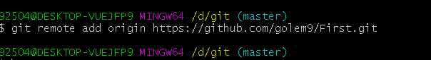
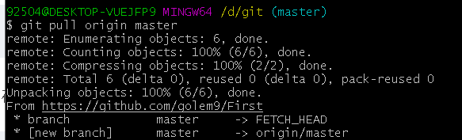
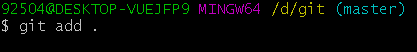
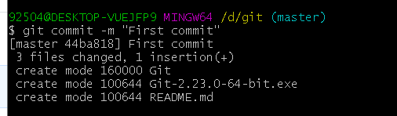
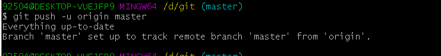

## 一、购买腾讯云

百度腾讯云

进入学生云服务器入口

购买一年，并登录

##### 使用xshell登录腾讯云服务器

连接

 

## 二、git提交实验至github

创建仓库

添加远程代码仓库的URL

验证是否成功

首先从远程代码仓库拉取数据

新建README文档

新建README文档，README文档是每个GitHub项目必备

添加文件夹中的所有文件：

推送本地更新至远程服务器：

## 三、本地安装VMware Workstation和CentOS操作系统

进入虚拟机

