# 实验四：Ceph的安装与实践

### 创建一个Ceph用户

在所有节点上创建一个名为“ cephuser” 的新用户。

 

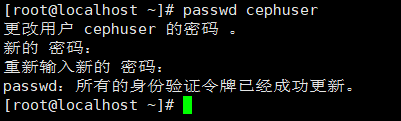  

### **运行以下命令为用户创建一个sudoers文件，并使用sed编辑/ etc / sudoers文件。**

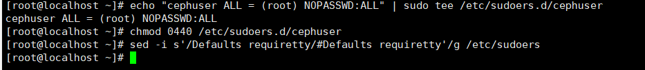  

### **安装和配置NTP**

安装NTP以同步所有节点上的日期和时间。运行ntpdate命令通过NTP协议设置日期和时间，我们将使用us pool NTP服务器。然后启动并启用NTP服务器在引导时运行。

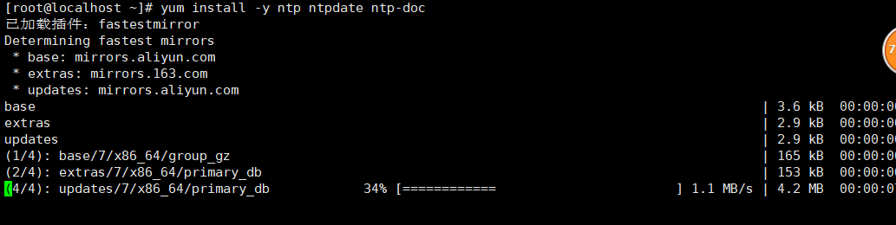  

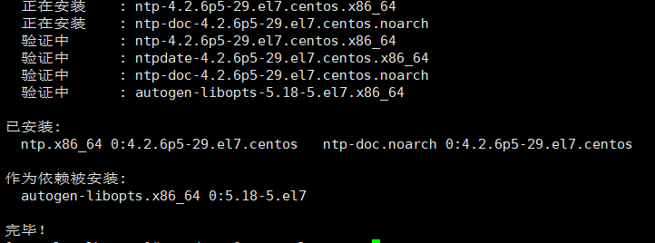  

  

### **安装Open-vm-tools**

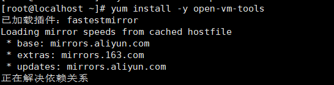  

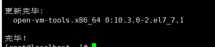  

### **禁用SELinux**

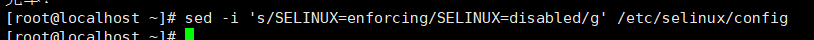  

 

 

复制虚拟机

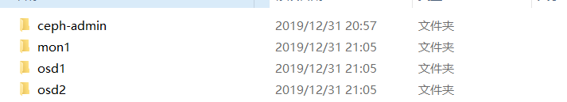  

 

 

进入vi /etc/sysconfig/network-scripts/ifcfg-ens33

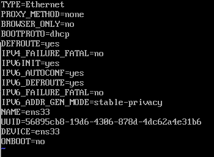  

然后将ONBOOT=no修改成yes

  

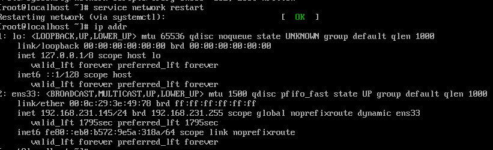  

连接xshell

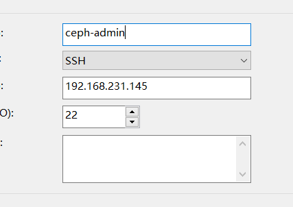  

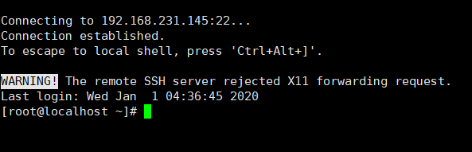  

四台虚拟机都要写上

  

192.168.231.149  ceph-admin

192.168.231.145  mon1

192.168.231.150  osd1

192.168.231.151  osd2

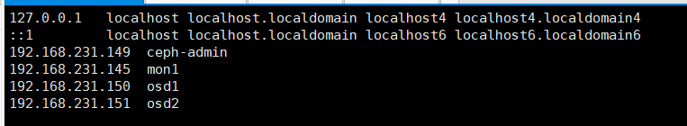  

尝试使用主机名在服务器之间ping通，

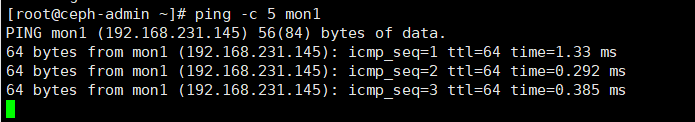  

 

安装ssh服务器

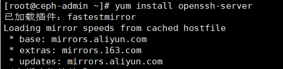  

免密登录ssh

  

为“ **cephuser** ” 生成ssh密钥。

  

接下来，为ssh配置创建配置文件

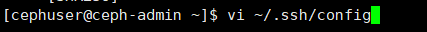  

粘贴以下配置：

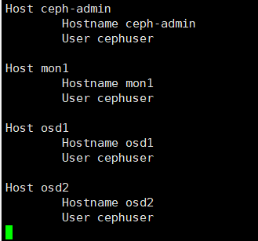  

更改配置文件的权限

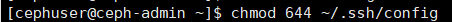  

现在，使用ssh-copy-id命令将SSH密钥添加到所有节点。

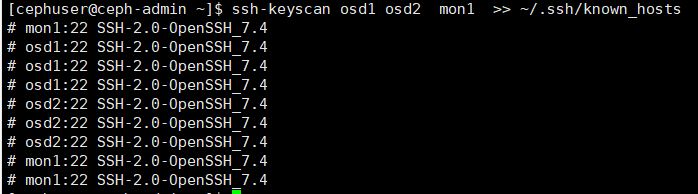  

根据要求输入您的“ cephuser”密码。

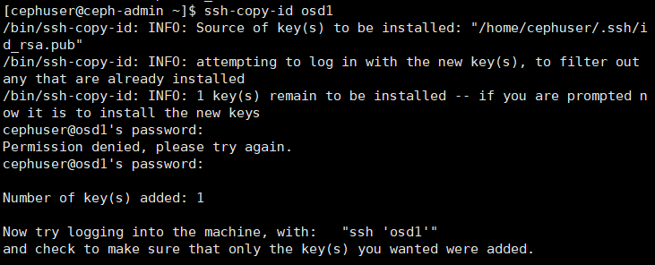  

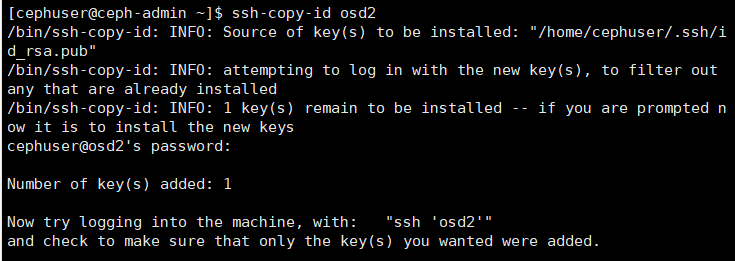  

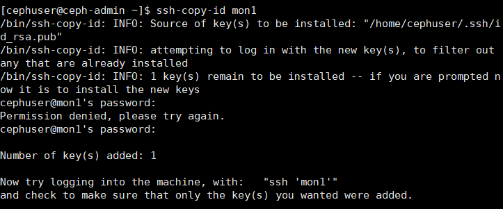  

完成后，请尝试从ceph-admin节点访问osd1服务器。

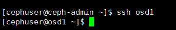  

## **配置防火墙**

登录到ceph-admin节点并启动firewalld。

systemctl start firewalld 

systemctl t enable firewalld 

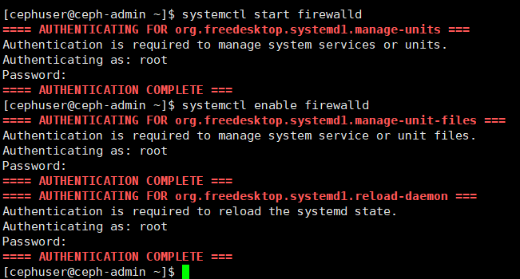  

打开端口80、2003和4505-4506，然后重新加载防火墙。

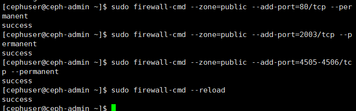  

切换到mon1，在Ceph监视节点上打开新端口，然后重新加载防火墙。

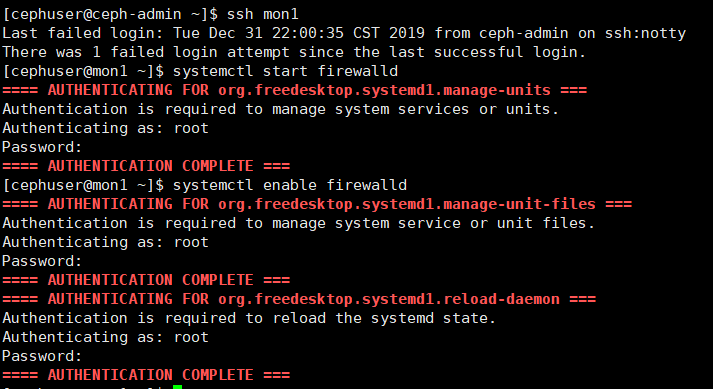  

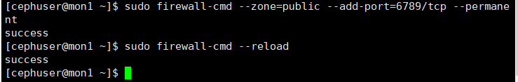  

最后，打开每个osd节点上的端口6800-7300-osd1，osd2

从ceph-admin节点登录到每个osd节点。

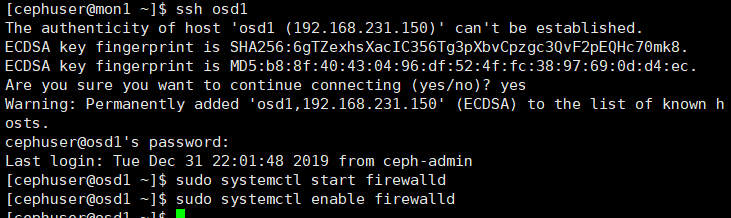  

打开端口并重新加载防火墙。

 

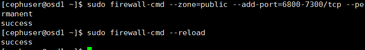  

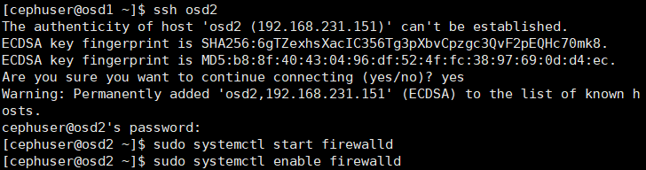  

打开端口并重新加载防火墙。

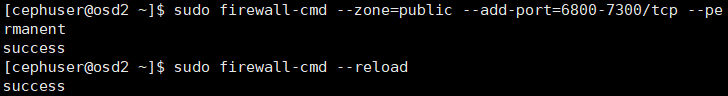  

 

## **构建Ceph集群**

登录到ceph-admin节点。

添加Ceph存储库，并使用yum命令安装Ceph部署工具' **ceph-deploy** '。

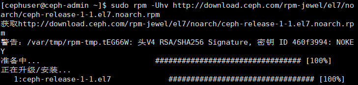  

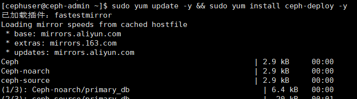  

创建新的群集目录。

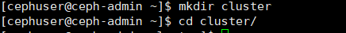  

接下来，使用“ **ceph -deploy** ”命令创建一个新的集群配置，将监视节点定义为“ **mon1** ”。

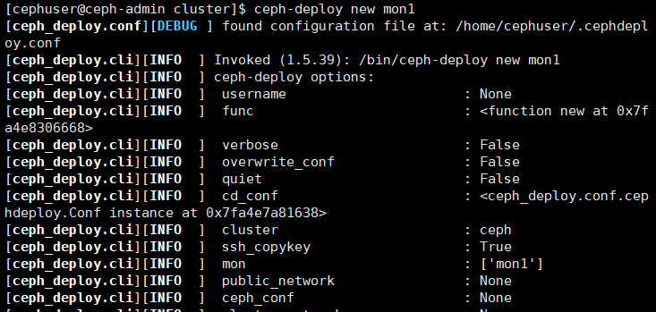  

用vi编辑ceph.conf文件。

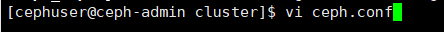  

在[global]块下，在下面粘贴配置。

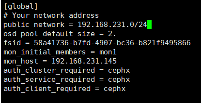  

现在，从ceph-admin节点在所有其他节点上安装Ceph。这可以通过单个命令完成。

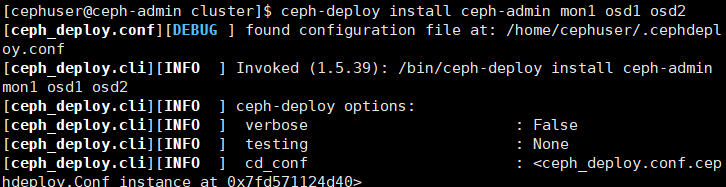  

 

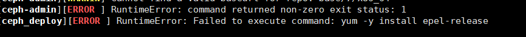  

cd /etc/yum.repos.d

sudo rm -f ./epel.repo

sudo rm -f ./epel-testing.repo

再次输入就可以了

现在将ceph-mon部署在mon1节点上。

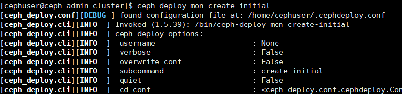  

该命令将创建监视键，并使用“ ceph”命令检查并获取键。

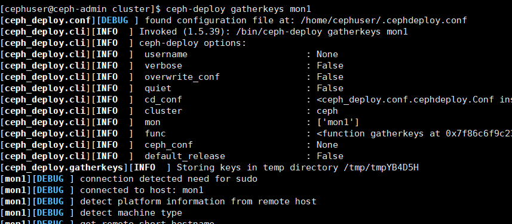  

通过在所有节点上运行以下命令来更改密钥文件的权限。

  

从**ceph** -admin节点登录到**ceph**监视服务器“ **mon1** ”。

运行以下命令以检查集群运行状况。

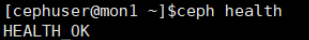  

现在检查集群状态。

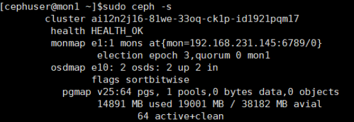  