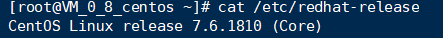

## 实验三：Docker基础实验

查看操作系统内核信息：

Linux的版本号：

该命令将root用户加入“wheel”用户组。在CentOS 7中默认情况下，wheel用户组的用户能够使用sudo命令。

## 实验1：安装Docker

更新应用程序数据库：

接下来添加Docker的官方仓库，下载最新的Docker并安装：

安装完成之后启动Docker守护进程，即Docker服务：**(每次操作都要启动)**

验证Docker是否成功启动：

最后，确保Docker当服务器启动时自启动：

此外，还可以查看一下Docker的版本信息:

## 实验2.1：完成Docker安装之后加载CentOS镜像

熟悉docker命令

输入docker

查看当前系统docker的相关信息：可见未安装任何镜像容器

搜寻可用镜像：

接下来拉取官方版本(OFFICIAL)的镜像：

基于该镜像运行容器，使用run命令：

查看一下当前系统中存在的镜像：

拉取CentOS镜像后运行一个容器实例，以上述的CentOS镜像为例运行其容器：

查看已启动的容器

**start docker**

**进入容器前台开始制作镜像**

## 实验2.2：在Docker的CentOS容器实例中安装WordPress

安装Apache Web服务器，使用yum工具安装：

启动httpd

**开启httpd**

移动到html文件夹下

创建

输入11,然后在网站上运行

## 创建新的镜像

退出shell交互

查看已有的docker容器

将容器生成镜像

docker commit -a "golem99" -m "wordpress on centos" f9f6e2176485 golem99/centos:apache_web

登录docker

## 推送镜像

docker push golem99/centos:apache_web

## 实验三：利用Dockerfile文件创建包含WordPress的镜像

参考：https://www.cnblogs.com/Smbands/p/10150449.html

首先呢，先写一个简单的控制脚本：

在start.sh中写入

创建dockerfile文件

写入

解压wordpressd到/var/www/html

构建镜像容器 :docker build -t  镜像名：TAG  Dockerfile的路径：docker build -t golem:1  .

运行

docker run -dit -p 9090:80 golem:1 

进入

docker exec -it ee2  /bin/bashd

成功

